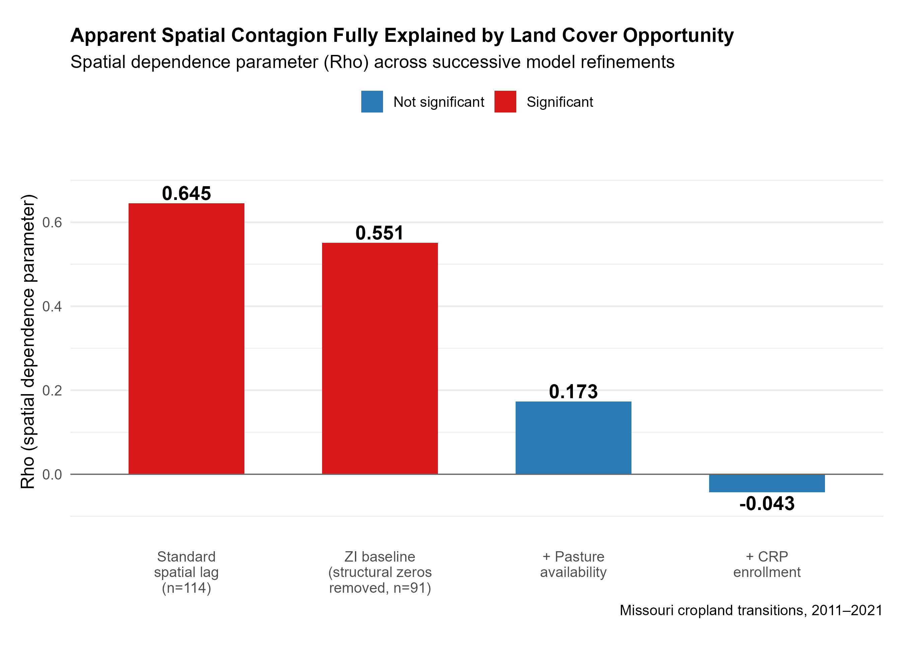
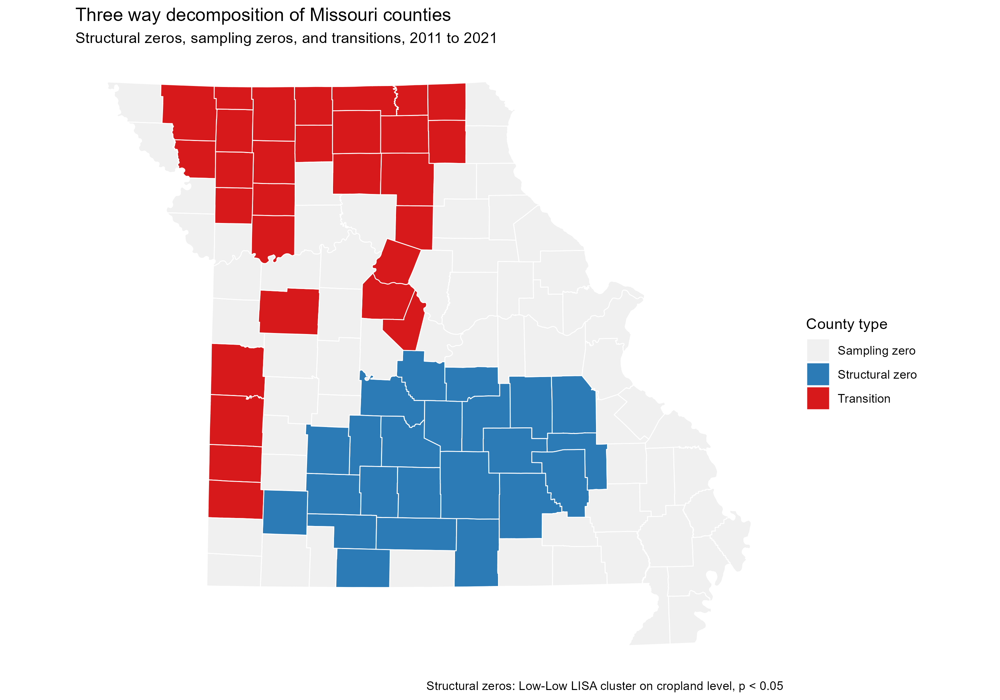
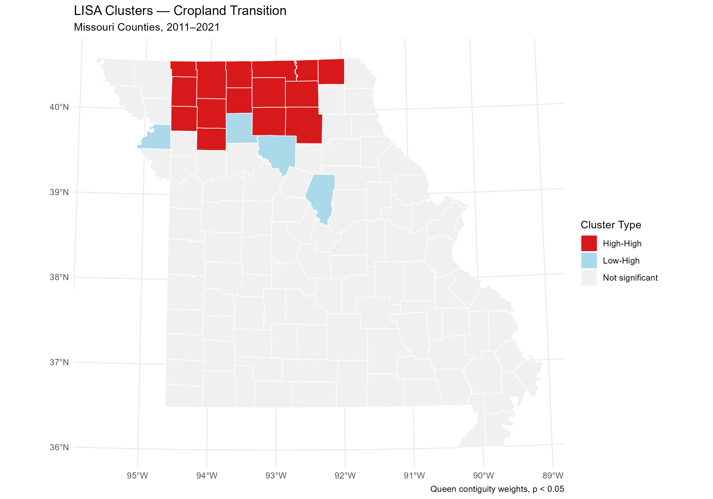

# Zero-inflated-Spatial

Extending zero-inflated modeling into spatial econometrics: separating the structural non-transition process from the transition process in land use data. Companion to gRDA-Optimizer in addressing sparsity across different methodological contexts.

## Overview

Standard spatial econometric models assume well-behaved outcome distributions. Land use transition data and many other spatial outcomes in economics are structurally sparse: most observations report no change in any given period. This project develops and applies a zero-inflated spatial econometric framework that models the zero-generating process separately from the transition process.

**A key methodological finding from this project's application:** a statistically significant spatial dependence parameter does not by itself confirm behavioral contagion between neighboring units. In the Missouri application below, what initially appeared as strong spatial contagion in cropland transitions (Rho = 0.645 in a standard spatial lag model) was fully explained once land cover opportunity — pasture availability and Conservation Reserve Program enrollment — was properly measured (Rho becomes statistically indistinguishable from zero). The zero-inflated spatial framework was essential to this finding: it separated counties structurally incapable of transition from those actively making transition decisions, exposing the true mechanism within the active sub-sample. Researchers applying spatial econometric models to land use or other agricultural outcomes should test whether spatially clustered land cover composition can account for apparent spatial dependence before interpreting it as evidence of genuine neighbor influence.

Missouri county-level cropland transitions from the National Land Cover Database (2001–2021) serve as the primary application. The methodological contribution travels to any sparse spatial outcome: flood adaptation, environmental compliance, agricultural technology adoption.

## Key Result

The spatial dependence parameter collapses from 0.645 to statistically zero as the model correctly accounts for (1) structural non-transition counties and (2) land cover opportunity. What looked like neighbor contagion was geographic clustering of convertible land.

## Empirical Setup

Missouri counties decompose into three groups: structural zeros (blue, Ozark highlands — structurally incapable of cropland transition due to forest cover and terrain), sampling zeros (grey — capable but did not transition), and active transitions (red — northern grain belt and southeast bootheel). The zero-inflated framework models these as distinct processes rather than pooling all non-transitions together.

## Spatial Clustering of Transitions

Local indicators of spatial association (LISA) confirm that transitions cluster significantly in northern Missouri (High-High, p < 0.05) while the rest of the state shows no significant spatial pattern in the transition indicator. This clustering motivated the original spatial contagion hypothesis — later shown to be explained by land cover composition rather than genuine neighbor influence.

## Repository Structure
- `/data/raw` — original downloaded files (not version controlled if large)
- `/data/processed` — cleaned analytical datasets
- `/scripts` — numbered R scripts in execution order
- `/outputs` — tables, figures, maps
- `/docs` — data construction notes, model specification, diagnostic memos

## Data Sources
- National Land Cover Database (NLCD): https://www.mrlc.gov
- USDA NASS Census of Agriculture: https://www.nass.usda.gov
- USDA FSA Conservation Reserve Program statistics: https://www.fsa.usda.gov/tools/informational/reports/conservation-statistics/crp
- Census TIGER/Line county shapefiles: https://www.census.gov/geographies/mapping-files.html

## Software
R version 4.x. Key packages: sf, terra, exactextractr, spdep, spatialreg.
Full session information: see `docs/session_info.txt`

## Related Work
- [gRDA-Optimizer](https://github.com/YOUR_USERNAME/gRDA-Optimizer): sparsity-promoting methods in deep learning — the same sparsity problem in a different methodological context
- Tran, L. (2026). Measuring what matters: How Zero-Inflated Latent Class Analysis reveals hidden heterogeneity in U.S. Household Climate Vulnerability. AAEA Annual Meeting, Kansas City, MO. July 2026 (forthcoming).
- Tran, L. et al. (2023). Measuring pesticide overuse: Evidence from Vietnamese rice and fruit farms. AJARE, 67(4), 417–437.

## Status
Active development. Started June 2026.